# Python-Practicum
Python Practicum - prepare for your interview or just get a refresher.

# Data
1. Data visualization using data on births from the state of North Carolina. 
2. Data manupulation is based on "txhousing.csv"

# Sample Insights

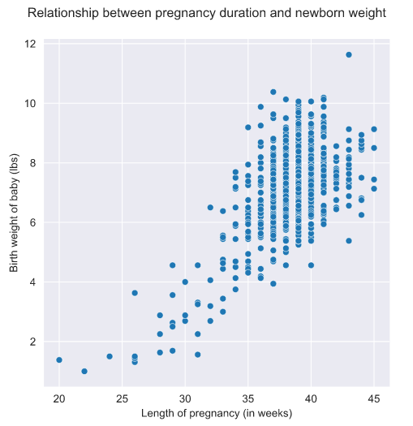

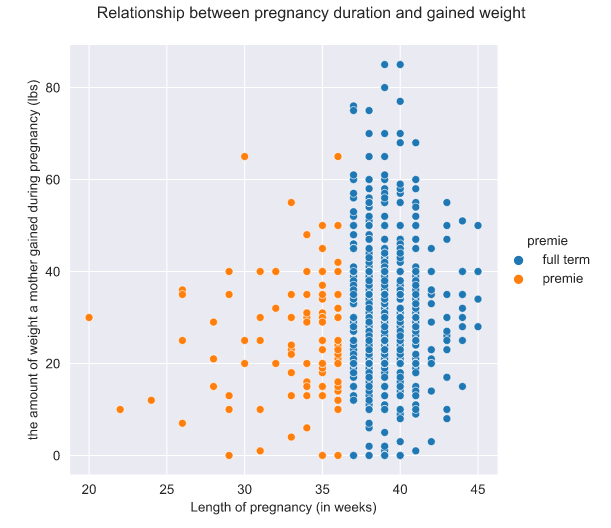

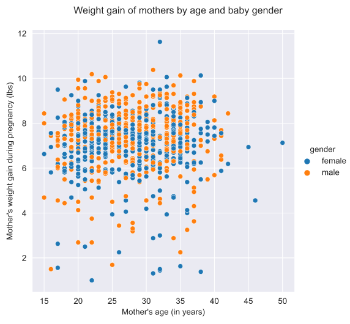

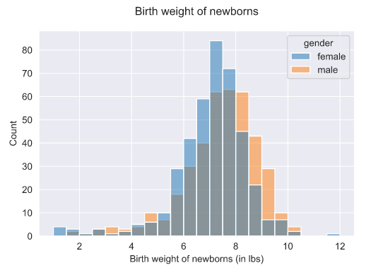

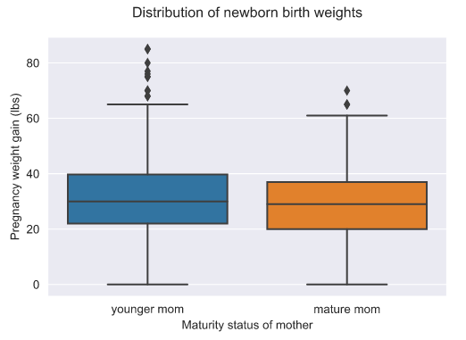

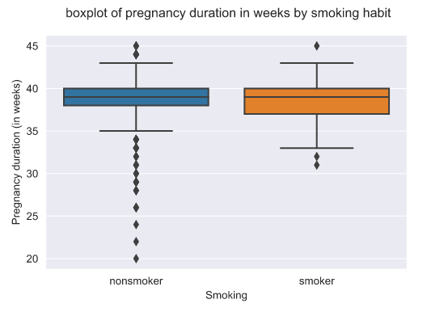

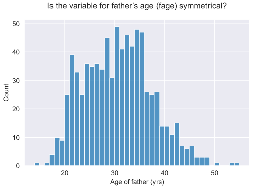

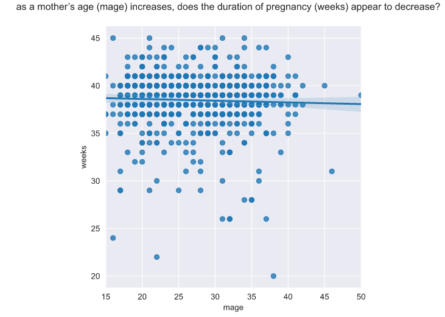

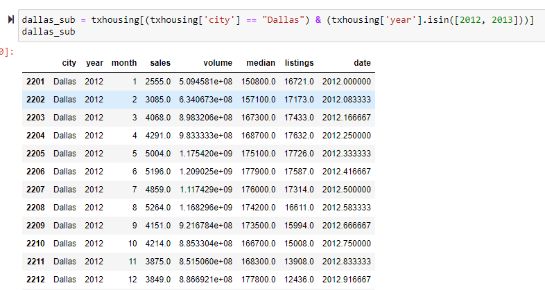

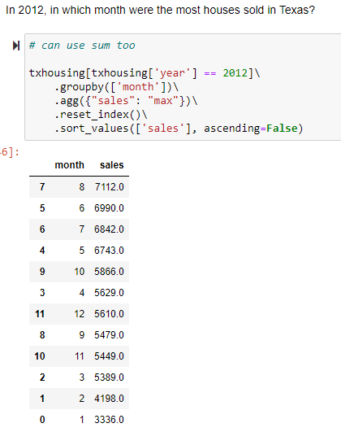

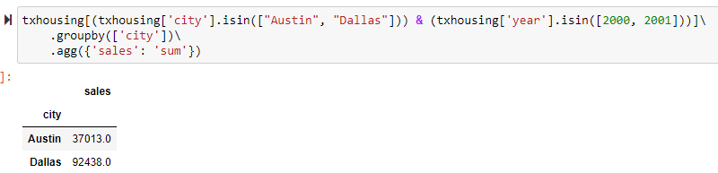

